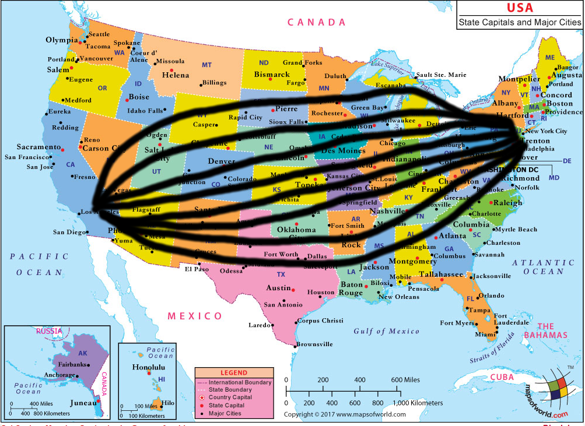

*Based on a talk I gave on multiple occurrences from 2018 to 2019.*
*Most of the numbers are based on 2018 research, the COVID-19 pandemic greatly sped up internet bandwidth use.*
*The key argument presented here holds regardless due to gross technological assumptions and lower boundary estimations.*

## Designing a Teleporter for Humans

Let's assume, we want to teleport between New York City (NYC) and Los Angeles (LA).
That are approx. 3940 km in distance.

(Image source: https://www.mapsofworld.com/usa/usa-capital-and-major-cities-map.html )

For sake of argument, assume we already have the following technology:

* Human serializer, deserializer
* ...which is ethics committee approved
* Very capable engineers operating the machinery
* Sufficient power and biomass supply
* Despite the massive amount of personal data being processed, it's all GDPR compliant!

Having solved all those very hard problems already, we *just* need to transfer the serialized human data.

### How Much Data Is a Human Anyway?

Some lower boundary estimations:

* Brain: macro storage capacity of 100 TB to 2.5 PB
* Human DNA: ~725 MB uncompressed, 4-5 MB compressed, per cell
* Cells in human body: 3.72 * 10^13 (37.2 trillion)
* Compressed human: **min. 148800 PB** (assuming 4 MB per cell, treating brain as normal cells, ignoring macro storage capacity due to insignificance)

### Connecting the Dots...

Now that we know, how much data we need to transfer, let's lay a optical fiber cable between LA and NYC.

For instance, the powerful transatlantic cable MAREA can support up to 20 TB/s (2018). Using this cable at maximum bandwidth, that would result in a transfer time of at least 86 days. Uff!

### Greatly connecting the dots ...

Okay, one cable may not be enough. How about we relay all internet infrastructure to North America, connecting just LA and NYC.

In 2016, all internet traffic had been 36.45 TB/s on average.
At that rate, the transfer time would still be at least 47.25 days.

### Moving the Body

By contrast, if one would walk the distance of LA-NYC by foot (5 km/h, 9 hours walking/day), it would take about 88 days.
Trained, fit people may complete it faster, e.g. the Pacific Crest Trail (PCT) has a comparable distance of 4250 km. The unsupported record for the PCT is ~61 days.

So, teleportation with assumed and current technology is on the scale of walking.
Instead of transferring the data over some cable, large amounts of data are usually transferred by shipping the harddrives from one data center to another. [There is an xkcd on that topic!](https://what-if.xkcd.com/31/)

It is not far-fetched to assume that the human body is a pretty efficient device to store all relevant data of a single human. So instead of serializing, saving to disk, moving the disks, de-serializing the human, we could also just move the human body by car or jet plane, which would beat teleportation by a magnitude (reducing transfer duration from days to hours).

## Why Do We Want to Teleport?

Now, we have learned, that teleportation is on the scale of walking, driving and flying:
Why do we still want to teleport?

All desired use-cases can be attributed to one of the following two equivalence classes:

* Want to have an impact elsewhere
* Want to let elsewhere have an impact on us (e.g. avoiding an unpleasant situation and getting moved to a more pleasant one)

The key problems of teleportation are both technological feasibility and *desire*.
We want to be somewhere where we aren't right now and we want to be there fast!

### With and Without Teleportation

But what if teleportation would be possible, but some would just not use it?

|teleportation|walking|
|---|---|
|7:00 Breakfast|7:00 Leave home, walk to work, get breakfast on way|
|7:45 Teleport to work|7:45 Arrive at work|
|---|---|
|16:30 To gym|16:30 Fetch friend, walk home|
|17:30 To home, friend teleports over|17:30 Arrive home|

Both schedules with and without ("walking") teleportation result in the same outcome:

* Breakfast achieved, arrived at work and worked
* Having a workout, meeting a friend and arriving back home

What "hacks" were used to achieve the same result without teleportation, just walking?

* Parallelization: Most people can both walk and eat and talk
* Schedule alignment: the distant friend doesn't need to teleport over if spacetime coordinates are aligned using a fast channel and less information
* The human need for physical activity: the teleporter still needs to workout, the stroller already walked for 1.5h that day

## Try It Yourself!

Walk a short distance, maybe a home where every step is conscious and desired.

Here we learned that moving the body (best storage medium for human data) is faster than transferring data (keyword "FedEx bandwidth"). Thus moving consciously and desiring most steps on the way is "faster" than teleportation achieved through technology.

## Common Concerns / FAQ

### But but ... how about space?

 <!-- .element style="border: none; background: none; width: 30%;" -->

* [Nope! Because Shannon's limit!](https://en.wikipedia.org/wiki/Noisy-channel_coding_theorem) <!-- .element: class="fragment" -->
* Project "Laser Light Communications": 100 Gbit/s, ~ 0.0125 TB/s (in development) <!-- .element: class="fragment" -->

Note: MAREA has 1600 times the bandwidth!

### But I'd still like a serialized copy of my body as a backup!

* Body is adapted to current times
* "Saving the body" results in suboptimal adaption. Think you skipped a pandemic: you might get very sick/die after de-serialization! Think of long-term prison inmates released to the modern world -- they are having trouble fitting in again.

